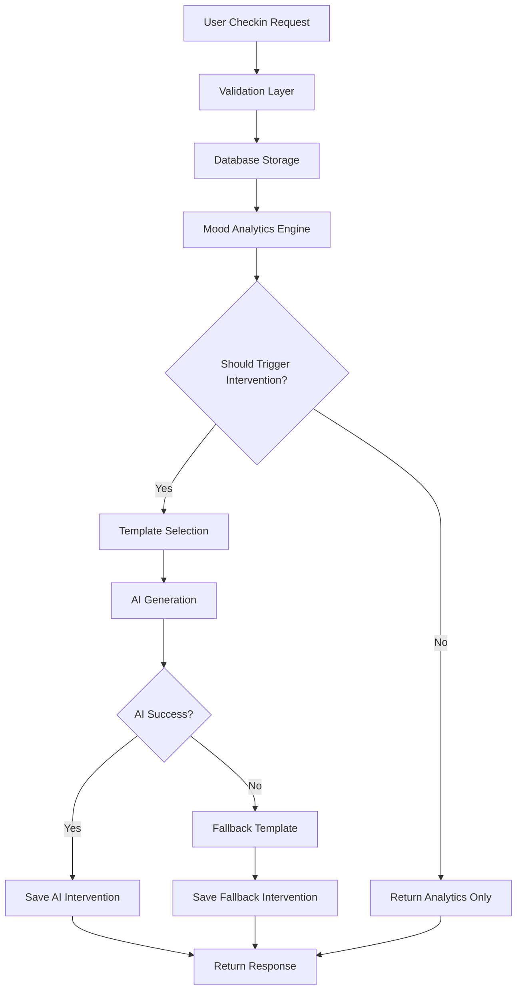

# Tài Liệu Logic Checkin và Intervention - Design

## Tổng quan

Hệ thống checkin-intervention được thiết kế để thu thập dữ liệu tâm trạng hàng ngày của người dùng và tự động tạo ra các tin nhắn can thiệp (intervention) phù hợp dựa trên phân tích mood patterns. Hệ thống sử dụng kết hợp thuật toán rule-based và AI generation để tạo ra các tin nhắn cá nhân hóa.

## Kiến trúc tổng thể



## Các thành phần chính

### 1. Checkin API Handler (`/api/checkins`)

**Chức năng chính:**
- Xử lý POST request để tạo checkin mới
- Xử lý GET request để lấy lịch sử checkin
- Validation dữ liệu đầu vào
- Trigger intervention generation

**Input Validation:**
- `moodScore`: số nguyên 1-5
- `energyLevel`: enum ['low', 'mid', 'high'] 
- `freeText`: string tối đa 280 ký tự

**Flow xử lý POST:**
1. Authenticate user qua Supabase session
2. Validate input data
3. Insert checkin record vào database
4. Fetch 7 checkin gần nhất để tính analytics
5. Tính toán mood analytics và intervention trigger
6. Nếu cần intervention, gọi `triggerInterventionGeneration()`
7. Return response với analytics data

### 2. Mood Analytics Engine (`lib/mood-analytics.ts`)

**Các thuật toán chính:**

#### Mood Average Calculation
```typescript
function calculateMoodAverage(checkins: CheckinRecord[], limit: number = 3): number {
  const recentCheckins = checkins.slice(0, limit)
  const totalMood = recentCheckins.reduce((sum, checkin) => sum + checkin.mood_score, 0)
  return Math.round((totalMood / recentCheckins.length) * 10) / 10
}
```

#### Mood Trend Analysis
```typescript
function calculateMoodTrend(checkins: CheckinRecord[]): 'improving' | 'declining' | 'stable' {
  const midPoint = Math.floor(checkins.length / 2)
  const recentHalf = checkins.slice(0, midPoint)
  const olderHalf = checkins.slice(midPoint)
  
  const recentAvg = calculateMoodAverage(recentHalf, recentHalf.length)
  const olderAvg = calculateMoodAverage(olderHalf, olderHalf.length)
  const difference = recentAvg - olderAvg

  if (difference > 0.3) return 'improving'
  if (difference < -0.3) return 'declining'
  return 'stable'
}
```

#### Streak Calculation
- Đếm số ngày liên tiếp có checkin
- Bắt đầu từ hôm nay và đếm ngược
- Dừng khi gặp ngày không có checkin

### 3. Intervention Decision Engine

**Trigger Conditions:**
```typescript
function shouldTriggerIntervention(checkins: CheckinRecord[]): boolean {
  const analytics = generateMoodAnalytics(checkins)
  
  // Condition 1: Very low mood
  if (analytics.averageMood <= 2) return true
  
  // Condition 2: Declining trend with low mood
  if (analytics.moodTrend === 'declining' && analytics.averageMood <= 3) return true
  
  // Condition 3: Engaged users (3+ checkins)
  if (checkins.length >= 3) return true
  
  return false
}
```

**Template Selection Logic:**
```typescript
function selectInterventionTemplate(moodAverage: number): InterventionTemplate {
  if (moodAverage <= 2.5) return 'compassion'      // Low mood - cần support
  if (moodAverage <= 3.5) return 'reflection'      // Neutral - khuyến khích suy ngẫm
  return 'action'                                   // Good mood - khuyến khích hành động
}
```

### 4. AI Integration Layer (`lib/openai-client.ts`)

**OpenAI Generation Flow:**
1. Tạo context object với mood data và personality traits
2. Xác định intervention type dựa trên mood patterns
3. Tạo personalized prompt cho OpenAI
4. Gọi GPT-4o-mini API với system prompt và user context
5. Parse JSON response và validate format
6. Return structured intervention message

**Fallback Mechanism:**
- Khi OpenAI API fails, sử dụng pre-defined templates
- Fallback templates được customize theo template type
- Set `fallback: true` flag để tracking

### 5. Intervention Templates (`lib/intervention-templates.ts`)

**Template Types:**

#### Compassion Template (mood ≤ 2.5)
- Focus: Emotional support và validation
- Tone: Warm, empathetic, understanding
- Actions: Self-care, reaching out, comfort activities

#### Reflection Template (2.5 < mood ≤ 3.5)  
- Focus: Self-awareness và insight
- Tone: Curious, thoughtful, non-judgmental
- Actions: Journaling, mindfulness, pattern recognition

#### Action Template (mood > 3.5)
- Focus: Goal-setting và forward movement
- Tone: Energizing, motivational, encouraging  
- Actions: Concrete steps, skill-building, momentum

**Personality Enhancement:**
- Sử dụng Big Five personality traits để customize message
- Điều chỉnh tone và suggestions dựa trên personality profile
- Ví dụ: High neuroticism → thêm emotional validation

## Data Models

### Checkin Record
```typescript
interface CheckinRecord {
  id: string
  user_id: string
  mood_score: number          // 1-5
  energy_level: 'low' | 'mid' | 'high'
  free_text: string | null    // max 280 chars
  created_at: string
  updated_at?: string
}
```

### Intervention Record
```typescript
interface InterventionRecord {
  id: string
  user_id: string
  checkin_id: string
  template_type: 'compassion' | 'reflection' | 'action'
  message_payload: {
    title: string
    body: string
    cta_text: string
  }
  fallback: boolean           // true if AI failed
  viewed: boolean
  created_at: string
}
```

### Analytics Response
```typescript
interface MoodAnalytics {
  mood_average: number | null
  mood_trend: 'improving' | 'declining' | 'stable'
  energy_distribution: { low: number; mid: number; high: number }
  intervention_triggered: boolean
  template_type: string | null
  recent_checkins_count: number
  streak_days: number
  total_checkins: number
}
```

## Error Handling

### Validation Errors
- Invalid mood score → 400 Bad Request
- Invalid energy level → 400 Bad Request  
- Free text too long → 400 Bad Request

### Database Errors
- Checkin save failure → 500 Internal Server Error
- Analytics fetch failure → Continue without analytics
- Intervention save failure → Log error, continue

### AI Generation Errors
- OpenAI API timeout → Use fallback template
- Invalid AI response → Use fallback template
- JSON parse error → Use fallback template

## Performance Considerations

### Database Optimization
- Index trên `user_id` và `created_at` cho fast queries
- Limit checkin fetch to 7 records để tính analytics
- Pagination cho GET requests với max 50 items

### Caching Strategy
- Mood analytics có thể cache trong 1 giờ
- Personality traits cache indefinitely until updated
- Intervention templates cache in memory

### Async Processing
- Intervention generation chạy synchronously trong request
- Có thể chuyển sang background job nếu cần optimize response time

## Security

### Authentication
- Tất cả endpoints require valid Supabase session
- User chỉ access được data của chính mình

### Data Validation
- Strict input validation để prevent injection
- Rate limiting để prevent abuse
- Free text sanitization

### Privacy
- Mood data được encrypt at rest
- AI prompts không include PII
- Intervention messages không log sensitive data

## Monitoring và Logging

### Key Metrics
- Checkin submission rate
- Intervention generation success rate
- AI vs fallback usage ratio
- User engagement với interventions

### Error Tracking
- OpenAI API failures
- Database connection issues
- Validation failures
- Intervention generation errors

### Performance Monitoring
- API response times
- Database query performance
- AI generation latency
- Memory usage patterns