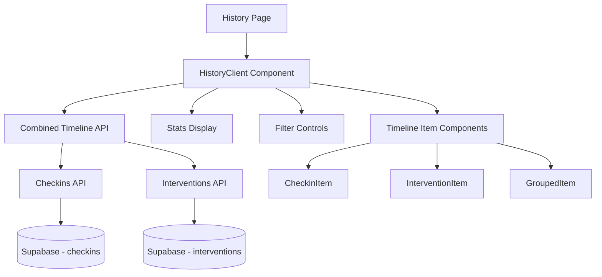

# Design Document

## Overview

History Page Enhancement sẽ cải tiến trang `/history` hiện tại để trở thành một timeline tích hợp hiển thị cả checkins và interventions của người dùng. Trang này sẽ cung cấp một cái nhìn tổng quan về hành trình cải thiện tâm lý của người dùng thông qua việc kết hợp dữ liệu từ các check-ins hàng ngày và các coaching messages tương ứng.

## Architecture

### High-Level Architecture



### Data Flow

1. **Page Load**: History page loads và khởi tạo HistoryClient component
2. **Data Fetching**: HistoryClient gọi API để lấy dữ liệu checkins và interventions
3. **Data Merging**: Client-side merge và sort dữ liệu theo thời gian
4. **Rendering**: Hiển thị timeline với các items được nhóm theo ngày
5. **Interactions**: Xử lý filtering, pagination, và user interactions

## Components and Interfaces

### 1. Page Component (`app/[locale]/(protected)/history/page.tsx`)

```typescript
interface HistoryPageProps {
  params: Promise<{ locale: string }>;
}

// Server component chịu trách nhiệm:
// - Authentication check
// - Locale setup
// - Render HistoryClient
```

### 2. HistoryClient Component (`components/HistoryClient.tsx`)

```typescript
interface HistoryClientProps {
  // No props needed - self-contained
}

interface TimelineItem {
  id: string;
  type: 'checkin' | 'intervention' | 'grouped';
  date: string;
  data: CheckinRecord | InterventionRecord | GroupedRecord;
}

interface GroupedRecord {
  checkin: CheckinRecord;
  interventions: InterventionRecord[];
}

interface FilterState {
  type: 'all' | 'checkins' | 'interventions';
  dateRange: 'week' | 'month' | 'quarter' | 'all';
  moodRange: [number, number] | null;
  templateTypes: string[];
}
```

### 3. Timeline Item Components

#### CheckinTimelineItem
```typescript
interface CheckinTimelineItemProps {
  checkin: CheckinRecord;
  showDate?: boolean;
  compact?: boolean;
}
```

#### InterventionTimelineItem
```typescript
interface InterventionTimelineItemProps {
  intervention: InterventionRecord;
  showDate?: boolean;
  compact?: boolean;
}
```

#### GroupedTimelineItem
```typescript
interface GroupedTimelineItemProps {
  checkin: CheckinRecord;
  interventions: InterventionRecord[];
  showDate?: boolean;
}
```

### 4. Stats Component

```typescript
interface HistoryStatsProps {
  stats: {
    totalCheckins: number;
    totalInterventions: number;
    avgMoodScore: number;
    energyDistribution: { low: number; mid: number; high: number };
    streakDays: number;
    moodTrend: 'improving' | 'declining' | 'stable';
  };
}
```

### 5. Filter Component

```typescript
interface HistoryFiltersProps {
  filters: FilterState;
  onFiltersChange: (filters: FilterState) => void;
  stats: HistoryStats;
}
```

## Data Models

### Combined Timeline API Response

```typescript
interface HistoryApiResponse {
  success: boolean;
  data: {
    timeline: TimelineItem[];
    stats: HistoryStats;
  };
  pagination: {
    limit: number;
    offset: number;
    total: number;
    has_more: boolean;
  };
}

interface HistoryStats {
  totalCheckins: number;
  totalInterventions: number;
  avgMoodScore: number;
  energyDistribution: { low: number; mid: number; high: number };
  streakDays: number;
  moodTrend: 'improving' | 'declining' | 'stable';
  dateRange: { from: string; to: string };
}
```

### Existing Data Models (Reused)

```typescript
interface CheckinRecord {
  id: string;
  user_id: string;
  mood_score: number;
  energy_level: 'low' | 'mid' | 'high';
  free_text: string | null;
  created_at: string;
}

interface InterventionRecord {
  id: string;
  user_id: string;
  checkin_id: string;
  template_type: 'compassion' | 'reflection' | 'action';
  message_payload: {
    title: string;
    body: string;
    cta_text: string;
  };
  fallback: boolean;
  viewed: boolean;
  feedback_score: number | null;
  created_at: string;
  feedback_at: string | null;
}
```

## API Design

### New Combined History API (`/api/history`)

```typescript
// GET /api/history?limit=20&offset=0&type=all&date_range=month&include_stats=true

interface HistoryApiParams {
  limit?: number; // default: 20, max: 50
  offset?: number; // default: 0
  type?: 'all' | 'checkins' | 'interventions'; // default: 'all'
  date_range?: 'week' | 'month' | 'quarter' | 'all'; // default: 'month'
  mood_min?: number; // 1-5
  mood_max?: number; // 1-5
  template_types?: string; // comma-separated
  include_stats?: boolean; // default: false
}
```

### Data Processing Logic

1. **Fetch Data**: Parallel fetch từ checkins và interventions APIs
2. **Filter Application**: Apply filters trước khi merge
3. **Data Merging**: 
   - Group interventions by checkin_id
   - Merge với corresponding checkins
   - Create timeline items
4. **Sorting**: Sort by created_at descending
5. **Pagination**: Apply limit/offset sau khi merge
6. **Stats Calculation**: Calculate stats từ filtered data

## User Interface Design

### Layout Structure

```
┌─────────────────────────────────────────┐
│ History Page Header                     │
├─────────────────────────────────────────┤
│ Stats Cards Row (4 cards)              │
├─────────────────────────────────────────┤
│ Filter Controls                         │
├─────────────────────────────────────────┤
│ Timeline Container                      │
│ ┌─────────────────────────────────────┐ │
│ │ Timeline Item 1 (Grouped)           │ │
│ │ ├─ Checkin                          │ │
│ │ └─ Related Interventions            │ │
│ ├─────────────────────────────────────┤ │
│ │ Timeline Item 2 (Standalone)       │ │
│ ├─────────────────────────────────────┤ │
│ │ ...                                 │ │
│ └─────────────────────────────────────┘ │
├─────────────────────────────────────────┤
│ Load More / Pagination                  │
└─────────────────────────────────────────┘
```

### Responsive Design

#### Desktop (≥1024px)
- 4-column stats grid
- Side-by-side filter controls
- Full timeline with expanded details
- Hover effects và tooltips

#### Tablet (768px-1023px)
- 2x2 stats grid
- Stacked filter controls
- Condensed timeline items
- Touch-friendly interactions

#### Mobile (<768px)
- Single column stats
- Collapsible filter drawer
- Compact timeline cards
- Swipe gestures support

### Visual Design Elements

#### Timeline Items
- **Grouped Items**: Card với checkin ở top, interventions ở bottom
- **Standalone Items**: Single card cho checkin hoặc intervention
- **Date Separators**: Sticky date headers khi scroll
- **Connection Lines**: Visual lines connecting related items

#### Color Coding
- **Mood Scores**: Gradient từ red (1) đến green (5)
- **Energy Levels**: Battery icons với colors (red/yellow/green)
- **Template Types**: 
  - Compassion: Pink/Rose
  - Reflection: Yellow/Amber
  - Action: Blue/Indigo

#### Icons
- Checkin: Calendar/Clock
- Intervention: MessageCircle/Heart/Lightbulb/Target
- Stats: TrendingUp/TrendingDown/BarChart
- Filters: Filter/Search/Calendar

## Error Handling

### Error States

1. **Authentication Error**: Redirect to login
2. **Network Error**: Retry button với exponential backoff
3. **Data Loading Error**: Error message với refresh option
4. **Empty State**: Helpful message với call-to-action
5. **Filter No Results**: Clear filters suggestion

### Loading States

1. **Initial Load**: Skeleton cards cho timeline items
2. **Filter Change**: Loading overlay trên existing content
3. **Pagination**: Loading spinner trên load more button
4. **Stats Update**: Shimmer effect trên stats cards

### Error Recovery

```typescript
interface ErrorBoundaryState {
  hasError: boolean;
  error: Error | null;
  errorInfo: ErrorInfo | null;
}

// Implement error boundary với:
// - Error logging
// - User-friendly error messages
// - Retry mechanisms
// - Fallback UI
```

## Testing Strategy

### Unit Tests
- Timeline data merging logic
- Filter application functions
- Date formatting utilities
- Stats calculation functions
- Component rendering với different props

### Integration Tests
- API endpoint responses
- Data flow từ API đến UI
- Filter interactions
- Pagination behavior
- Error handling scenarios

### E2E Tests
- Complete user journey
- Cross-browser compatibility
- Mobile responsiveness
- Performance benchmarks
- Accessibility compliance

### Performance Tests
- Large dataset handling (1000+ items)
- Memory usage monitoring
- Scroll performance
- API response times
- Bundle size impact

## Internationalization

### Translation Keys Structure

```json
{
  "history": {
    "title": "History",
    "subtitle": "Your wellness journey timeline",
    "stats": {
      "totalCheckins": "Total Check-ins",
      "totalInterventions": "Coaching Messages",
      "avgMoodScore": "Average Mood",
      "streakDays": "Current Streak",
      "moodTrend": {
        "improving": "Improving",
        "declining": "Needs attention", 
        "stable": "Stable"
      }
    },
    "filters": {
      "type": "Type",
      "dateRange": "Date Range",
      "moodRange": "Mood Range",
      "templateTypes": "Message Types",
      "all": "All",
      "checkins": "Check-ins",
      "interventions": "Messages",
      "week": "Last Week",
      "month": "Last Month",
      "quarter": "Last 3 Months"
    },
    "timeline": {
      "today": "Today",
      "yesterday": "Yesterday",
      "daysAgo": "{days} days ago",
      "groupedWith": "with coaching message",
      "noData": "No history found",
      "loadMore": "Load More"
    },
    "errors": {
      "loadFailed": "Failed to load history",
      "tryAgain": "Try Again",
      "noResults": "No results found for current filters"
    }
  }
}
```

### Locale-Specific Formatting
- Date/time formatting theo locale
- Number formatting (mood scores, percentages)
- Relative time strings
- Cultural considerations cho colors và icons

## Performance Considerations

### Optimization Strategies

1. **Data Fetching**
   - Parallel API calls
   - Intelligent caching
   - Incremental loading
   - Request deduplication

2. **Rendering**
   - Virtual scrolling cho large lists
   - Memoization của expensive calculations
   - Lazy loading của images
   - Component code splitting

3. **Memory Management**
   - Cleanup của event listeners
   - Proper dependency arrays
   - Avoid memory leaks trong useEffect
   - Efficient data structures

4. **Bundle Size**
   - Tree shaking
   - Dynamic imports
   - Shared components reuse
   - Minimal external dependencies

### Performance Metrics

- **First Contentful Paint**: < 1.5s
- **Largest Contentful Paint**: < 2.5s
- **Time to Interactive**: < 3.5s
- **Cumulative Layout Shift**: < 0.1
- **Bundle Size Impact**: < 50KB additional

## Security Considerations

### Data Protection
- User data isolation (RLS policies)
- Input sanitization
- XSS prevention
- CSRF protection

### API Security
- Authentication required
- Rate limiting
- Input validation
- SQL injection prevention

### Privacy
- No sensitive data logging
- Secure data transmission
- Minimal data exposure
- User consent compliance