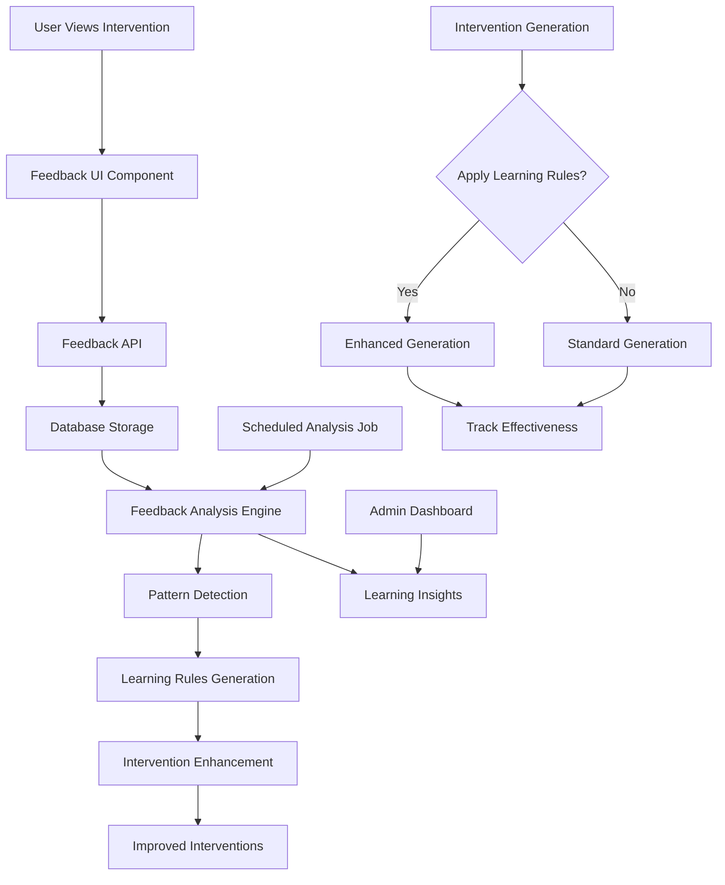

# Intervention Feedback Learning System - Design

## Tổng quan

Hệ thống Intervention Feedback Learning được thiết kế để cải thiện chất lượng intervention messages thông qua việc học hỏi từ feedback của người dùng. Hệ thống sẽ thu thập feedback, phân tích patterns từ negative feedback, và áp dụng insights để tối ưu hóa thuật toán sinh intervention.

## Kiến trúc tổng thể



## Các thành phần chính

### 1. Feedback Collection System

#### 1.1 Feedback UI Component
**File:** `components/InterventionFeedback.tsx`

```typescript
interface InterventionFeedbackProps {
  interventionId: string
  onFeedbackSubmit?: (score: number, comment?: string) => void
}

interface FeedbackState {
  score: number | null
  comment: string
  isSubmitting: boolean
  hasSubmitted: boolean
}
```

**Chức năng:**
- Hiển thị 5-star rating interface
- Thu thập optional text feedback cho ratings ≤ 2 sao
- Prevent duplicate feedback submissions
- Show feedback confirmation
- Track feedback analytics (time to feedback, completion rate)

#### 1.2 Enhanced Feedback API
**File:** `app/api/intervention-feedback/route.ts` (mở rộng)

**Mở rộng chức năng hiện tại:**
- Thêm support cho text feedback comments
- Validate feedback quality (minimum comment length cho negative feedback)
- Trigger learning analysis cho negative feedback
- Track feedback metadata (device, time spent viewing)

```typescript
interface FeedbackSubmission {
  interventionId: string
  score: number // 1-5
  comment?: string // Required if score <= 2
  timeSpentViewing?: number // seconds
  deviceType?: string
}
```

### 2. Database Schema Extensions

#### 2.1 Intervention Feedback Table
```sql
-- Extend interventions table
ALTER TABLE public.interventions 
ADD COLUMN feedback_comment text,
ADD COLUMN feedback_metadata jsonb,
ADD COLUMN time_spent_viewing int; -- seconds

-- Add feedback analysis tracking
CREATE TABLE public.intervention_feedback_analysis (
  id uuid PRIMARY KEY DEFAULT gen_random_uuid(),
  intervention_id uuid REFERENCES public.interventions(id) ON DELETE CASCADE,
  analysis_type text NOT NULL CHECK (analysis_type IN ('negative_pattern', 'effectiveness_tracking')),
  analysis_data jsonb NOT NULL,
  created_at timestamptz DEFAULT now()
);
```

#### 2.2 Learning Rules Table
```sql
CREATE TABLE public.intervention_learning_rules (
  id uuid PRIMARY KEY DEFAULT gen_random_uuid(),
  rule_type text NOT NULL CHECK (rule_type IN ('avoid_pattern', 'enhance_pattern', 'personalization')),
  rule_data jsonb NOT NULL,
  confidence_score decimal(3,2) NOT NULL CHECK (confidence_score BETWEEN 0 AND 1),
  sample_size int NOT NULL,
  effectiveness_score decimal(3,2),
  is_active boolean DEFAULT true,
  created_at timestamptz DEFAULT now(),
  updated_at timestamptz DEFAULT now()
);

-- Index for efficient rule lookup
CREATE INDEX idx_learning_rules_active ON public.intervention_learning_rules(is_active, rule_type);
```

#### 2.3 User Feedback Patterns Table
```sql
CREATE TABLE public.user_feedback_patterns (
  id uuid PRIMARY KEY DEFAULT gen_random_uuid(),
  user_id uuid REFERENCES public.users(id) ON DELETE CASCADE,
  pattern_type text NOT NULL,
  pattern_data jsonb NOT NULL,
  confidence_score decimal(3,2) NOT NULL,
  last_updated timestamptz DEFAULT now()
);

-- Index for user-specific pattern lookup
CREATE INDEX idx_user_feedback_patterns ON public.user_feedback_patterns(user_id, pattern_type);
```

### 3. Feedback Analysis Engine

#### 3.1 Pattern Detection Service
**File:** `lib/feedback-analysis.ts`

```typescript
interface FeedbackPattern {
  type: 'template_mismatch' | 'personality_conflict' | 'timing_issue' | 'content_quality'
  description: string
  confidence: number
  sampleSize: number
  examples: string[]
}

interface NegativeFeedbackAnalysis {
  interventionId: string
  patterns: FeedbackPattern[]
  recommendations: string[]
  severity: 'low' | 'medium' | 'high'
}
```

**Thuật toán phân tích:**

1. **Template Effectiveness Analysis**
   - Tính average feedback score cho mỗi template type
   - Phát hiện template types có negative feedback rate cao
   - Phân tích correlation giữa mood context và template effectiveness

2. **Personality-Feedback Correlation**
   - Phân tích feedback patterns theo Big Five traits
   - Xác định personality profiles dễ có negative feedback
   - Tạo personalization rules dựa trên personality insights

3. **Content Quality Analysis**
   - NLP analysis của feedback comments để tìm common complaints
   - Sentiment analysis của intervention messages vs feedback
   - Identify overused phrases hoặc ineffective language patterns

4. **Timing and Context Analysis**
   - Phân tích correlation giữa mood context và feedback quality
   - Xác định optimal timing cho intervention delivery
   - Analyze energy level impact on intervention effectiveness

#### 3.2 Learning Rules Generator
**File:** `lib/learning-rules-generator.ts`

```typescript
interface LearningRule {
  id: string
  type: 'avoid_pattern' | 'enhance_pattern' | 'personalization'
  condition: RuleCondition
  action: RuleAction
  confidence: number
  sampleSize: number
}

interface RuleCondition {
  moodRange?: [number, number]
  templateType?: InterventionTemplate
  personalityTraits?: Partial<BigFiveScores>
  energyLevel?: string
  userHistory?: string
}

interface RuleAction {
  type: 'avoid_template' | 'modify_content' | 'adjust_timing' | 'personalize_message'
  parameters: Record<string, any>
}
```

**Rule Generation Logic:**

1. **Avoid Pattern Rules**
   - Nếu template X có >40% negative feedback trong context Y → tạo avoid rule
   - Nếu specific phrases có correlation với negative feedback → avoid rule

2. **Enhancement Pattern Rules**
   - Nếu certain modifications có correlation với positive feedback → enhance rule
   - Nếu personality-specific content có better feedback → personalization rule

3. **User-Specific Rules**
   - Track individual user feedback patterns
   - Tạo personalized rules cho users có consistent feedback patterns

### 4. Enhanced Intervention Generation

#### 4.1 Rule Application Engine
**File:** `lib/intervention-enhancement.ts`

```typescript
interface EnhancedInterventionParams extends ProcessInterventionParams {
  learningRules: LearningRule[]
  userFeedbackHistory: UserFeedbackPattern[]
}

interface InterventionEnhancement {
  originalTemplate: InterventionTemplate
  adjustedTemplate?: InterventionTemplate
  contentModifications: string[]
  personalizations: string[]
  appliedRules: string[]
}
```

**Enhancement Process:**

1. **Pre-Generation Rule Application**
   - Check avoid rules trước khi select template
   - Apply user-specific preferences từ feedback history
   - Adjust template selection dựa trên learning rules

2. **Content Enhancement**
   - Apply content modification rules
   - Enhance với personality-specific insights
   - Avoid identified negative patterns

3. **Post-Generation Validation**
   - Validate enhanced intervention against quality rules
   - Ensure compliance với learning constraints
   - Track applied enhancements cho effectiveness measurement

#### 4.2 A/B Testing Framework
**File:** `lib/intervention-ab-testing.ts`

```typescript
interface ABTestConfig {
  testId: string
  name: string
  variants: InterventionVariant[]
  trafficSplit: number[]
  successMetrics: string[]
  isActive: boolean
}

interface InterventionVariant {
  id: string
  name: string
  modifications: InterventionEnhancement
  sampleSize: number
  averageFeedback: number
}
```

**A/B Testing cho Learning Rules:**
- Test new learning rules với control group
- Measure effectiveness của rule applications
- Gradual rollout của validated improvements

### 5. Analytics và Monitoring

#### 5.1 Learning Effectiveness Dashboard
**File:** `components/admin/LearningDashboard.tsx`

**Key Metrics:**
- Average feedback score trends
- Negative feedback rate reduction
- Learning rule effectiveness scores
- User engagement với improved interventions
- Template performance comparisons

#### 5.2 Real-time Monitoring
**File:** `lib/feedback-monitoring.ts`

```typescript
interface FeedbackMetrics {
  dailyFeedbackCount: number
  averageFeedbackScore: number
  negativeFeedbackRate: number
  learningRuleApplicationRate: number
  improvementTrend: 'positive' | 'negative' | 'stable'
}
```

**Monitoring Alerts:**
- Spike trong negative feedback rate
- Learning rule effectiveness drops
- Unusual feedback patterns
- System performance issues

### 6. Data Models

#### 6.1 Enhanced Intervention Record
```typescript
interface EnhancedInterventionRecord extends InterventionRecord {
  feedback_score?: number
  feedback_comment?: string
  feedback_at?: string
  feedback_metadata?: {
    timeSpentViewing?: number
    deviceType?: string
    feedbackDelay?: number
  }
  applied_learning_rules?: string[]
  enhancement_data?: InterventionEnhancement
}
```

#### 6.2 Learning Analytics
```typescript
interface LearningAnalytics {
  totalFeedbackCount: number
  averageFeedbackScore: number
  feedbackDistribution: Record<number, number>
  negativeFeedbackRate: number
  topNegativePatterns: FeedbackPattern[]
  activeLearningRules: number
  ruleEffectiveness: Record<string, number>
  improvementMetrics: {
    feedbackScoreImprovement: number
    negativeFeedbackReduction: number
    userSatisfactionTrend: string
  }
}
```

## Error Handling

### Feedback Collection Errors
- Network failures → Store feedback locally, retry later
- Validation errors → Clear user feedback với helpful messages
- Duplicate submissions → Prevent với client-side tracking

### Analysis Engine Errors
- Pattern detection failures → Log errors, continue với existing rules
- Rule generation errors → Fallback to manual rule creation
- Database errors → Graceful degradation, maintain service availability

### Enhancement Application Errors
- Rule application failures → Fallback to standard intervention generation
- Content modification errors → Use original content với logging
- A/B testing errors → Default to control group behavior

## Performance Considerations

### Feedback Analysis Optimization
- Batch process feedback analysis (daily/weekly)
- Cache frequently accessed patterns và rules
- Optimize database queries với proper indexing
- Async processing cho non-critical analysis

### Real-time Enhancement
- Cache active learning rules in memory
- Minimize rule application overhead
- Efficient rule matching algorithms
- Fallback mechanisms cho performance issues

### Scalability
- Horizontal scaling cho analysis workloads
- Database partitioning cho large feedback datasets
- CDN caching cho static learning insights
- Queue-based processing cho heavy analytics

## Security và Privacy

### Data Protection
- Encrypt sensitive feedback comments
- Anonymize data cho pattern analysis
- Secure API endpoints với proper authentication
- GDPR compliance cho feedback data retention

### Access Control
- Role-based access cho learning insights
- User consent cho feedback usage in improvements
- Audit logging cho learning rule modifications
- Secure admin dashboard access

## Testing Strategy

### Unit Testing
- Feedback collection component testing
- Pattern detection algorithm testing
- Learning rule generation logic testing
- Enhancement application testing

### Integration Testing
- End-to-end feedback flow testing
- Database integration testing
- API endpoint testing
- A/B testing framework validation

### Performance Testing
- Feedback analysis performance under load
- Rule application latency testing
- Database query optimization validation
- Memory usage monitoring

### User Acceptance Testing
- Feedback UI usability testing
- Intervention quality improvement validation
- User satisfaction measurement
- Admin dashboard functionality testing