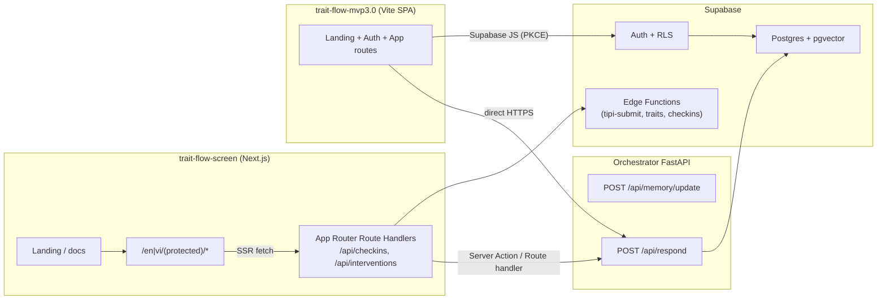

# Trait Flow Screen × Trait Flow v3.0 統合計画

このドキュメントは、`trait-flow-screen`（Next.js + Supabase）に既存の Web 体験を保持しつつ、[`trait-flow-mvp3.0`](https://github.com/k-naruse3209/trait-flow-mvp3.0) が提供する Vite 製モバイル体験を共存させるための設計方針をまとめたものです。両リポジトリの責務、共有すべきサービス、API 契約、そして実装ロードマップを明確にし、単一プロダクトとして機能させることを目指します。

---

## 1. 現状のシステム概要

| 項目 | trait-flow-screen (Next.js + Supabase) | trait-flow-mvp3.0 (Vite + React Router) |
| --- | --- | --- |
| UI スタック | Next.js 15 App Router、shadcn/ui、Suspense データ取得（`app/[locale]/(protected)/dashboard/page.tsx`） | Vite + React Router。`App.tsx` にモバイル優先の画面を実装 |
| 認証 | Supabase Auth（`lib/supabase/server.ts`、middleware） | メール入力画面のみで実認証なし |
| データ層 | Supabase Postgres テーブル & Edge Functions（`supabase/migrations/*`、`supabase/functions/tipi-submit/index.ts`） | ローカル state + モックデータ（`App.tsx`、`services/aiService.ts`） |
| AI / 介入 | `lib/intervention-processor.ts`、`lib/openai-client.ts` による OpenAI 連携 + フォールバック | `services/aiService.ts` が決め打ちメッセージを返却。README に `/api/memory/update` と `/api/respond` が定義済み |
| デプロイ | Supabase Auth + Vercel/Next 向け。`.env.example` にシークレットを列挙 | README で S3+CloudFront または App Runner(Docker) を想定 |

要点: `trait-flow-screen` は TIPI、日次チェックイン、ダッシュボードなどを実データで扱える状態。一方 `trait-flow-mvp3.0` は最新のモバイル UX と Orchestrator 要件を提供するが、まだ実サービスとは接続されていない。

---

## 2. 統合ゴール

1. **単一のバックエンド** – Supabase（`supabase/migrations/20241010000001_initial_schema.sql` 等）を唯一のデータソースとして維持。
2. **共通 AI サービス** – 既存ダッシュボード（`components/DashboardClient.tsx`）と Vite アプリは `docs/orchestrator_spec.md` の `/api/memory/update` `/api/respond` を共有。
3. **認証/セッションの一元化** – `trait-flow-screen` で発行された Supabase トークンをモバイル UI でもそのまま利用し、同一 `user_id` でデータを取得できるようにする。
4. **柔軟なデプロイ** – Next.js 側は Vercel/Supabase にそのまま出せる形を維持しつつ、Vite バンドルは S3+CloudFront / App Runner でホスト可能にする。両者で同じ環境変数契約を使う。

成功条件:
- ダッシュボード（`/en/(protected)/dashboard`）からモバイル版 v3 に切り替えても二度目のログインは不要。
- TIPI（`tipi-submit` Edge Function）や日次チェックインをどちらの UI から送信しても、同じ Supabase レコードが作成される。
- Orchestrator から返る介入が `interventions` に保存され、両 UI で同じ履歴が閲覧できる。

---

## 3. 目標アーキテクチャ



### 役割
- **trait-flow-screen**
  - Supabase 認証が必要なページ、設定、管理/レポート画面をホスト。
  - 認証済み Route Handler を提供し、Supabase・Orchestrator の BFF として振る舞うことでクライアント側に秘密鍵を持ち込まない。
  - `messages/*.json` や共通 React コンポーネントを提供し、Vite 側からもパッケージ経由で再利用できるようにする。

- **trait-flow-mvp3.0**
  - 同じ Supabase + Orchestrator を利用するモバイル向け UX（ランディング、オンボーディング、ホーム、履歴、設定）を提供。
  - S3+CloudFront や App Runner(Nginx) に置ける静的アセットをビルド。
  - ブラウザのみで動作させ、権限が必要な呼び出しは後述の BFF エンドポイント経由に統一する。

---

## 4. 統合ストラテジー

### 4.1 認証・セッション連携
1. **Vite 側で Supabase PKCE** – ブラウザクライアント + PKCE で同じ Supabase プロジェクトにログインし、セッションは `localStorage` に保持。
2. **トークン受け渡し** – Next の middleware は Supabase Cookie を参照済み。`/app/*` にディープリンクする際、Vite から `?token=` で PKCE トークンを渡せるエンドポイントを追加する。
3. **CSR/SSR の整合** – どちらの UI からログインしても Supabase JWT が共有され、片方でログアウトすれば両方から切れる状態を維持する。

### 4.2 API レイヤーflowchart LR
 
| Need | Owner | Implementation |
| --- | --- | --- |
| TIPI 送信 | Supabase Edge Function (`supabase/functions/tipi-submit/index.ts`) | Vite から `supabase.functions.invoke('tipi-submit')` を呼び出す。Next 側は既存のサーバーアクションで利用。 |
| 日次チェックイン | 新規 Edge Function `checkins-insert`（`hooks/useCheckinHistory.ts` が期待する API と合わせる） | 一度実装した Edge Function を Next ルートハンドラ (`app/api/checkins/route.ts`) でラップし、Service Role で代理実行する。 |
| 介入生成 | サーバー専用 `processInterventionWithAI` (`lib/intervention-processor.ts`) | Next ルート `/api/interventions` で呼び出し、Vite/Next の両 UI から安全にリクエストできるようにする。 |
| Orchestrator 連携 | BFF ルート `/api/orchestrator/*` | Next ルートで API キーと Supabase ユーザー情報を付与した上で FastAPI (`/api/memory/update`, `/api/respond`) へ転送。Vite は Supabase JWT を送り BFF を利用。 |

### 4.3 共通型定義
1. **`/packages/domain` の作成** – `BigFiveTrait`、`Checkin`、`PersonalizedMessage`、`MemoryUpdatePayload` などを含む共有パッケージを作成。`trait-flow-mvp3.0/types.ts` と Supabase schema をベースにする。
2. **Supabase 型生成** – `supabase gen types typescript` の結果を共有パッケージへ取り込み、`Database['public']['Tables']['checkins']['Row']` を双方で共通利用。
3. **翻訳・定数の共有** – TIPI 質問やラベルを持つ `constants.ts` を共有化し、両フレームワークから参照する。

### 4.4 UI 統合オプション
1. **独立モバイルバンドル** – `trait-flow-mvp3.0` を単独 SPA として CloudFront などに配置し、`https://app.traitflow.com/mobile` などで提供。バックエンドとは HTTPS 経由で通信。
2. **Next への埋め込み** – Next 内に `/mobile/*` ルートを作成し、まずは SPA を `<iframe>` として読み込み、段階的にコンポーネントを共有パッケージ経由で直接インポートしていく。

推奨: まずは埋め込み式 SPA でパイロットを開始し、その後 React Server Components と共有 UI パッケージを使って段階的に統合度を高める。

### 4.5 Orchestrator 連携
`docs/orchestrator_spec.md` で規定されている `POST /api/memory/update` と `POST /api/respond` を叩くクライアントを `trait-flow-screen/lib/orchestrator-client.ts` として実装。

```ts
export async function respond(prompt: RespondPayload, accessToken: string) {
  const res = await fetch(`${process.env.ORCHESTRATOR_URL}/api/respond`, {
    method: 'POST',
    headers: {
      Authorization: `Bearer ${accessToken}`,
      'x-traitflow-user': prompt.user_id,
      'Content-Type': 'application/json'
    },
    body: JSON.stringify(prompt)
  });
  if (!res.ok) throw new Error('Orchestrator failed');
  return res.json() as Promise<RespondResponse>;
}
```

Next ルートハンドラがサービス用クレデンシャルを注入し、Vite 側は FastAPI へ直接アクセスせず BFF を経由することで LLM API キー露出を防ぐ。App Runner などでプライベートネットワーク化した場合のみ、Supabase が発行する署名付き JWT を使って SPA から直接 FastAPI を呼び出す構成も検討する。

---

## 5. 実装ロードマップ

| フェーズ | 範囲 | 成果物 |
| --- | --- | --- |
| 0. 準備 | pnpm workspace / Turborepo 等で両リポジトリを連携し、`/packages/domain` に共通モデルを移行。 | 共有 `package.json`、型/定数群 |
| 1. バックエンド整備 | Supabase マイグレーションと型生成を完了させ、チェックイン/介入用 Edge Function と Orchestrator Proxy ルートを実装。 | `/app/api/checkins`、`/app/api/interventions`、`/app/api/orchestrator/*` |
| 2. Vite 側の実データ化 | `trait-flow-mvp3.0/App.tsx` のモック認証を Supabase PKCE に置換し、TIPI/チェックイン/履歴/介入を BFF 経由で実データと連携。 | モバイル UI で実データ表示 |
| 3. 埋め込み | Vite バンドルを `/mobile` 配下にリライト、もしくは CloudFront 版を Next ダッシュボードからディープリンク。 | シングルサインオンでデスクトップ ↔ モバイルに遷移可能 |
| 4. コンポーネント統合 | Vite の UI を順次 Next 側へ移植 or 共有 UI キット化し、チェックインカードや履歴などの重複を排除。 | 共有コンポーネントライブラリ |
| 5. 可観測性 | Orchestrator Proxy / Edge Functions のログ・メトリクスを CloudWatch 等に集約し、Slack/n8n 通知を整備（`docs/system_spec_ja.md` の構成に準拠）。 | 運用ダッシュボードと警告フロー |

---

## 6. 残課題・意思決定事項
1. **セッション伝播** – Vite SPA が Supabase Cookie を直接設定し Next でもそのまま使うか、Next から `/mobile` へ遷移する際に短命のマジックリンクを発行するかを決める。
2. **デプロイ構成** – 別ドメインでホストする場合、Supabase Auth のリダイレクト URL / CORS に `app.traitflow.com` と `mobile.traitflow.com` を追加する。
3. **AI ガードレール** – `lib/intervention-processor.ts` のフォールバックを維持するのか、Orchestrator 側でモデレーションまで完結させるのかを明確化。
4. **n8n・CRM 連携** – モバイルからのチェックイン送信でも `docs/system_spec_ja.md` §10 にある `behavior_events` などが必ず発火するよう、Edge Function か Orchestrator Worker のどちらで処理するか決定する。

本ドキュメントを最新の情報源とし、作業が進むたびに追記・更新してください。共有パッケージと BFF ルートが整えば、Vite 側の開発は既存契約を再利用する形となり、重複実装を避けられます。
