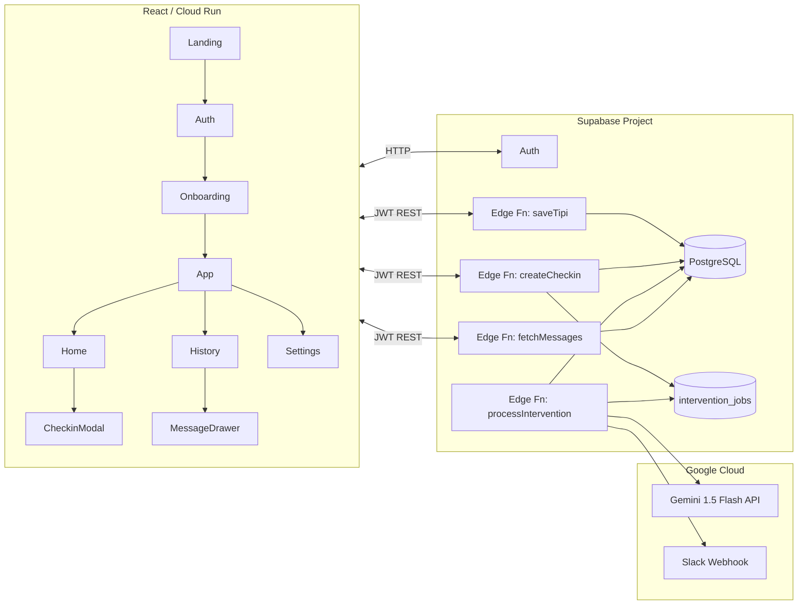

# Trait Flow v2.0 実運用仕様書

## 0. 背景
- 既存の AI Studio UI（React/Vite）をベースに、実際にユーザーの回答を保存・分析しながら AI からのフィードバックを生成できる **プロダクション対応構成** へ拡張する。
- 目標は「Big Five × 日次チェックイン × AI 介入」を **最小限の SLO（レスポンス ≤5 秒、成功率 ≥97%）で提供**し、5〜10 名のクローズドパイロットを安定運用できるようにすること。
- 基盤には Supabase（Auth + PostgreSQL + Edge Functions）を用い、Gemini 1.5 Flash を介入生成に採用する。Cloud Run 上でフロントエンドをホストし、Edge Functions を API ゲートウェイとして扱う。

## 1. 検証仮説 & 成功指標
- **仮説**
  1. ユーザー固有の Big Five プロファイルと直近チェックインを組み合わせた Gemini 生成メッセージは、汎用テンプレートより 20%以上「役に立つ」評価を得る。
  2. 1 回 1 分以内のチェックイン体験と即時フィードバックが、2 週間で 60% 以上の日次継続率を生む。
  3. Supabase + Edge Functions + Google Cloud Run の構成で、端末 3G 回線でも 5 秒以内にフィードバックを表示できる。
- **成功指標（2 週間）**
  - オンボーディング完了率 ≥ 85%（TIPI 全 10 問回答）。
  - 日次チェックイン継続率 ≥ 60%（登録ユーザーの 60% が 4 回以上投稿）。
  - メッセージの 5 段階評価で 4 以上の割合 ≥ 65%。
  - Gemini 呼び出し成功率 ≥ 97%、レスポンス中央値 < 4 秒。

## 2. スコープ
### 今回実装するもの
| レイヤ | 内容 |
| --- | --- |
| フロント | 既存 React UI を日本語のまま利用。Auth/Auth 状態管理、API 呼び出し、リアルデータ表示のための改修を追加。 |
| バックエンド | Supabase Auth, PostgreSQL スキーマ、Edge Functions 3 本（TIPI登録、チェックイン作成、介入生成）。 |
| AI サービス | Gemini 1.5 Flash API（REST）。Structured Output で `{title, body, tone}` を取得。 |
| 運用 | Cloud Run デプロイ、Supabase モニタリング、Slack 通知（失敗時）。 |

### スコープ外
 - Symanto / SNS 連携、Push 通知、ネイティブアプリ、A/B テスト、決済系。

## 3. ユーザーフロー（実運用版）
1. **アクセス & 認証**  
   Cloud Run 上の UI へアクセス → Supabase Auth（メールリンク）でログイン。
2. **TIPI オンボーディング**  
   10 問回答 → `baseline_traits` へ保存 → Gemini なしの簡易スコア結果を即時表示。
3. **ホーム**  
   API から当日のメッセージを取得。未読なら「チェックインしてメッセージを受け取る」を促す。
4. **チェックイン**  
   気分/エネルギー/メモを入力 → `/functions/v1/checkins` へ送信 → DB 保存後、キュー `intervention_jobs` にメッセージ生成を投入。
5. **AI メッセージ生成**  
   Edge Function Worker がジョブを処理し Gemini を呼び出し → `interventions` に保存 → フロントは SSE/ポーリングで結果取得。
6. **履歴 & フィードバック**  
   メッセージカードを開き評価（1〜5）を送信 → `feedback_score` 更新。

## 4. システム構成

## 5. 機能仕様
### 5.1 フロントエンド（主要コンポーネント）
- **Auth Gate**：Supabase Auth UI をラップし、JWT を取得。React Query で認証状態を管理。
- **TIPI Form (`OnboardingPage`)**  
  - API: `POST /functions/v1/tipi`  
  - Payload: `{ answers: Record<id, 1-7> }`  
  - Response: `{ scores: BigFiveScores }`  
  - 保存完了後、結果画面を表示し `/app/home` へ遷移。
- **Home**  
  - API: `GET /functions/v1/messages/today`  
  - レスポンスが `status: generating` ならローディングを表示、`completed` なら本文と評価 UI を出す。
- **CheckinModal**  
  - API: `POST /functions/v1/checkins`  
  - サーバーが 202 を返したらローディング状態に切り替え、`GET /functions/v1/messages/latest?checkin_id=` で 5 秒間隔のポーリング。
- **History**  
  - API: `GET /functions/v1/history?limit=20&cursor=...`  
  - メッセージ詳細で `PATCH /functions/v1/messages/{id}` を呼び、`feedback_score` を更新。

### 5.2 Edge Functions
| 関数 | 説明 |
| --- | --- |
| `saveTipi` | TIPI 回答を受け取り、Big Five スコアを算出して `baseline_traits` に UPSERT。 |
| `createCheckin` | チェックインを `checkins` に保存、`intervention_jobs` にジョブを enqueue、HTTP 202 を返す。 |
| `fetchMessages` | 今日のメッセージ / 履歴 / 評価更新を扱う REST エンドポイント集合。 |
| `processIntervention` | キューからジョブ取得 → Gemini 呼び出し → `interventions` へ保存 → Slack へ失敗通知。 |

### 5.3 Gemini 呼び出し仕様
- **モデル**: `gemini-1.5-flash`  
- **入力**:  
  - 上位/下位各 1 特性（数値）  
  - 直近 3 回の気分平均、最新チェックイン詳細  
  - ユーザーの週次目標（任意フィールド）  
- **プロンプトテンプレート**: JSON 形式で `title`（20 文字）、`body`（200 文字以内）、`tone`（`reflective | actionable | compassionate`）。  
- **タイムアウト**: 4 秒。失敗時はテンプレート文を使用し `interventions.use_fallback = true`。

## 6. データモデル
| テーブル | 主な列 |
| --- | --- |
| `users` | `id`, `email`, `created_at` |
| `baseline_traits` | `user_id`, `traits_avg` (JSON), `instrument`, `administered_at` |
| `checkins` | `id`, `user_id`, `mood_score`, `energy_level`, `note`, `created_at` |
| `intervention_jobs` | `id`, `user_id`, `checkin_id`, `status`, `attempts`, `payload`, `created_at` |
| `interventions` | `id`, `user_id`, `checkin_id`, `title`, `body`, `tone`, `feedback_score`, `use_fallback`, `created_at` |
| `user_settings` | `user_id`, `notification_channel`, `quiet_hours`, `weekly_goal`, `updated_at` |

RLS（Row Level Security）で `user_id = auth.uid()` の行のみ CRUD 可とする。

## 7. 外部サービス & 依存関係
- **Supabase**：Auth、PostgreSQL、Edge Functions、Storage（将来のメディア用途）。
- **Google Cloud**：Cloud Run（UI）、Secret Manager（API キー）、Gemini API、Cloud Scheduler（定期 Worker 起動）、Slack Webhook（運用通知）。
- **npm 依存**：React 19, React Router 7, React Query, Supabase JS, Tailwind（CDN）, Recharts, Vite 6。

## 8. 非機能要件
| 項目 | 要件 |
| --- | --- |
| レイテンシ | チェックイン送信からメッセージ表示まで平均 4 秒以内、p95 7 秒以内。 |
| 可用性 | UI/Edge Functions の稼働率 99%（Cloud Run / Supabase SLA）。 |
| 監視 | Supabase Logs + Cloud Logging。失敗時 Slack 通知。Gemini 使用量を日次エクスポート。 |
| セキュリティ | Supabase Auth + HTTPS。Edge Functions には JWT 必須。Gemini / Slack キーは Secret Manager 管理。 |
| バックアップ | DB は Supabase PITR を有効化。`interventions` は 90 日でアーカイブ。 |

## 9. オペレーション
1. **デプロイ**  
   - `npm run build` → Cloud Build → Cloud Run。  
   - Edge Functions は `supabase functions deploy`。  
2. **ランブック**  
   - Edge Function 5xx 増加 → Slack アラート → Cloud Logging で原因特定 → 必要ならキューを手動リプレイ。  
   - Gemini 限度超過 → Secret Manager でキー切替 or プラン変更。  
3. **サポート**  
   - パイロット参加者用に Slack/LINE グループを用意し、障害時は即時連絡。  

## 10. ロードマップ（6 週間）
1. Week1: Supabase プロジェクト初期化、Auth/Fn/DB スキーマ設計。
2. Week2: TIPI API とホーム画面のデータ取得を実装、CI/CD 整備。
3. Week3: チェックイン API + intervention_jobs → processIntervention Worker。
4. Week4: Gemini 連携、エラーハンドリング、Slack 通知。
5. Week5: QA（iOS/Android）・ロギング・観測性強化・小規模ドッグフーディング。
6. Week6: パイロットローンチ、週次で KPI/Feedback をレビュー。

## 11. リスクと対策
| リスク | 対策 |
| --- | --- |
| Gemini API 遅延 | タイムアウト＆テンプレート fallback、Queue 再試行（最大 3 回）。 |
| Supabase 障害 | Cloud Run 停止＆Slack 通知。緊急時はローカルテンプレートでオフラインモードを提供。 |
| 個人情報保護 | 取得 PII をメールアドレスのみに限定。利用規約・プライポリを公開。 |
| モバイル UX 破綻 | Storybook / Percy でビジュアルリグレッションテスト、主要端末で QA。 |

## 12. 参考資料
- 旧仕様: `trait-flow-mvp/docs/prototype_spec_ja.md`
- `trait-flow-mvp2.0/App.tsx`（UI 実装）
- Supabase Edge Functions & Auth ドキュメント
- Google Gemini API ドキュメント
- Cloud Run / Cloud Build / Secret Manager ベストプラクティス
