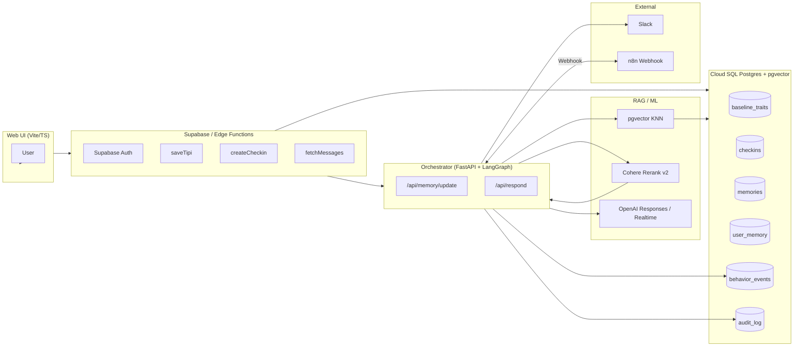
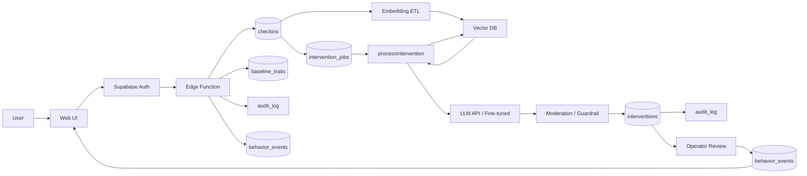
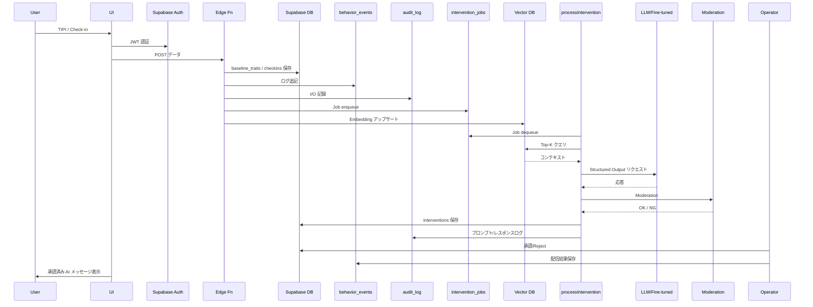
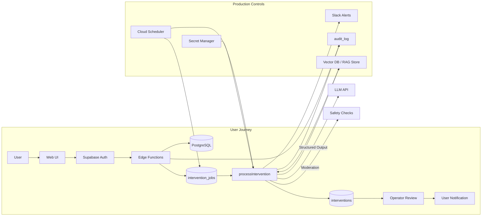
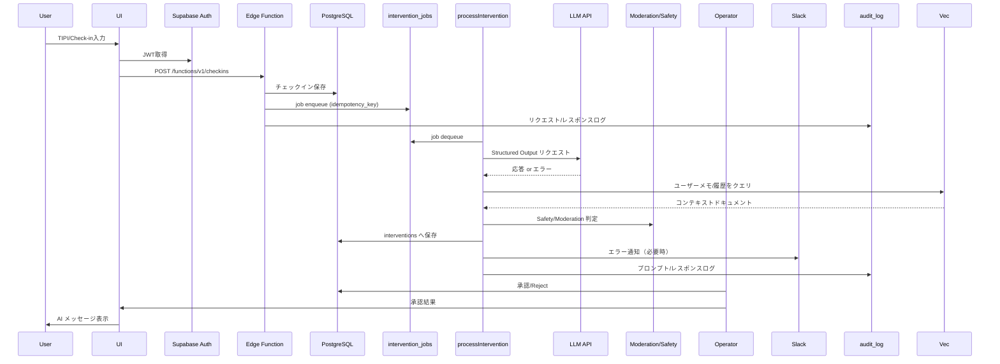

# Trait Flow v2.0 プロトタイプ仕様書

## 0. 背景
- 既存の Web UI をベースに、ユーザーの回答を保存・分析しながら AI からのフィードバックが動的に変化する **プロトタイプ** を短期間で成立させる。
- 同じアーキテクチャを基に、実際のユーザー回答を保存・分析しながら AI からのフィードバックを生成できる **プロダクション対応構成** へ段階的に拡張することを本仕様の最終目的とする。
- 目標は「Big Five × 日次チェックイン × AI 介入」の一連フローを実ユーザーデータで動かし、運用手順と拡張余地を確認すること。定量 KPI は設定せず、レスポンス体感や安定性をオペレーターが確認する。
- 基盤には Supabase（Auth + PostgreSQL + Edge Functions）を用い、フロントエンドは Cloud Run 上でホストする。介入生成に利用する LLM API はエンジニアが選定し、Structured Output/Moderation/フォールバックを実装可能なものを採用する。

## 1. プロトタイプ方針
- 検証仮説や成功指標は本仕様では扱わず、**ユーザー回答→処理→AI 応答が変化すること**を一貫したフローとして成立させることに専念する。
- 実データを Supabase に追記保存し、後から分析・リプレイできる構造を必須とする。
- LLM API の選定・チューニングはエンジニアに委任する（要件: Structured Output/Moderation/監査ログ/フォールバックを実装可能、SLA やコストは運用判断）。
- 将来的なプロダクション展開を見据えているが、プロトタイプ段階ではオペレーター監視・小規模ユーザー（5〜10 名）での安定動作に集中する。

## 2. スコープ
### 今回実装するもの
| レイヤ | 内容 |
| --- | --- |
| フロント | 既存 UI を日本語のまま利用。Auth/Auth 状態管理、API 呼び出し、リアルデータ表示のための改修を追加。 |
| バックエンド | Supabase Auth / PostgreSQL（pgvector）＋ Edge Functions。新規 Orchestrator（FastAPI + LangGraph + LlamaIndex）を追加し `/api/memory/update` `/api/respond` を提供。 |
| AI サービス | LLM: OpenAI Responses / Realtime。RAG: LlamaIndex + pgvector。再ランク: Cohere Rerank v2。 |
| 運用 | Cloud Run デプロイ、Supabase モニタリング、n8n で CRM/通知、Slack 通知（失敗時）。 |

### スコープ外
 - Symanto / SNS 連携、Push 通知、ネイティブアプリ、A/B テスト、決済系。

## 3. ユーザーフロー（プロトタイプ）
1. **アクセス & 認証**  
   Cloud Run 上の UI へアクセス → Supabase Auth（メールリンク）でログイン。
2. **TIPI オンボーディング**  
   10 問回答 → `baseline_traits` へ保存 → LLM 呼び出しなしの簡易スコア結果を即時表示。
3. **ホーム**  
   API から当日のメッセージを取得。未読なら「チェックインしてメッセージを受け取る」を促す。
4. **チェックイン**  
   気分/エネルギー/メモを入力 → `/functions/v1/checkins` へ送信 → DB 保存後、キュー `intervention_jobs` にメッセージ生成を投入。
5. **AI メッセージ生成**  
   Edge Function Worker がジョブを処理し 選定した LLM API を呼び出し → `interventions` に保存 → フロントは SSE/ポーリングで結果取得。
6. **履歴 & フィードバック**  
   メッセージカードを開き評価（1〜5）を送信 → `feedback_score` 更新。

## 4. システム構成

Orchestrator の詳細なフロー・API・デプロイ手順は `docs/orchestrator_spec.md` を参照。

## 5. 機能仕様
### 5.1 フロントエンド（主要コンポーネント）
| コンポーネント | 主な API / 挙動 |
| --- | --- |
| Auth Gate | Supabase Auth UI をラップし JWT を取得。クライアント側で認証状態をキャッシュ。 |
| TIPI Form (`OnboardingPage`) | `POST /functions/v1/tipi` に `{ answers: Record<id,1-7> }` を送信。レスポンス `{ scores: BigFiveScores }` を表示して `/app/home` へ遷移。 |
| Home | `GET /functions/v1/messages/today` を呼び、`status: generating` ならローディング、`completed` なら本文と評価 UI を表示。 |
| CheckinModal | `POST /functions/v1/checkins` を送信し HTTP 202 を受領後、`GET /functions/v1/messages/latest?checkin_id=` を 5 秒間隔でポーリング。 |
| History | `GET /functions/v1/history?limit=20&cursor=...` で一覧取得。詳細で `PATCH /functions/v1/messages/{id}` を呼び `feedback_score` を更新。 |

### 5.2 Orchestrator API（FastAPI + LangGraph）
- `/api/memory/update`: `{ user_id, text, kind }` を受け取り、OpenAI Embedding でベクトル化 → `memories` へ INSERT → `user_memory.long_term` を EMA 更新 → `policy` ベクトルを更新。  
- `/api/respond`: `{ user_id, query }` を受け取り、pgvector KNN (top=200) → Cohere Rerank (top=8) → OpenAI Responses（system に個人化方針を挿入）で応答。  
- LangGraph の State/Node/Edge で短期・長期・方針を保持し、RAG フローを再利用可能なグラフとして実装する。詳細は `docs/orchestrator_spec.md` を参照。

### 5.3 Edge Functions
| 関数 | 説明 |
| --- | --- |
| `saveTipi` | TIPI 回答を受け取り、Big Five スコアを算出して `baseline_traits` に UPSERT。 |
| `createCheckin` | チェックインを `checkins` に保存、`intervention_jobs` にジョブを enqueue、HTTP 202 を返す。Orchestrator と連携する場合は `/api/memory/update` を呼ぶトリガー。 |
| `fetchMessages` | 今日のメッセージ / 履歴 / 評価更新を扱う REST エンドポイント集合。 |
| `processIntervention` | レガシーフロー互換のため保持。Orchestrator 移行後は監査・バックフィル用に限定利用。 |

### 5.4 LLM 呼び出し仕様
| 項目 | 内容 |
| --- | --- |
| モデル選定 | エンジニアがレスポンス速度・コスト・日本語出力品質を基準に選択（例: Gemini 1.5 Flash, OpenAI Responses, Claude Haiku など）。 |
| 必須要件 | Structured Output で `{title, body, tone}` を返却できること／Moderation など安全制御を適用できること／平均 4 秒以内で応答できること。 |
| 入力 | 上位/下位特性（各 1）、直近 3 回の気分平均、最新チェックイン詳細、ユーザー週次目標（任意）。 |
| 出力 | `title`（20 文字）、`body`（200 文字以内）、`tone`（`reflective | actionable | compassionate`）。 |
| フォールバック | タイムアウト・エラー時はテンプレート文を使用し `interventions.use_fallback = true`。LLM 切替や再試行は I モジュールで制御。 |

## 6. データモデル
| テーブル | 主な列 |
| --- | --- |
| `users` | `id`, `email`, `created_at` |
| `baseline_traits` | `user_id`, `traits_avg` (JSON), `instrument`, `administered_at` |
| `checkins` | `id`, `user_id`, `mood_score`, `energy_level`, `note`, `created_at` |
| `user_memory` | `user_id`, `long_term` (vector), `policy` (vector), `last_updated` |
| `memories` | `id`, `user_id`, `kind`, `embedding` (vector), `text`, `created_at` |
| `intervention_jobs` | `id`, `user_id`, `checkin_id`, `status`, `attempts`, `payload`, `created_at` |
| `interventions` | `id`, `user_id`, `checkin_id`, `title`, `body`, `tone`, `feedback_score`, `use_fallback`, `created_at` |
| `user_settings` | `user_id`, `notification_channel`, `quiet_hours`, `weekly_goal`, `updated_at` |
| `behavior_events` | `id`, `user_id`, `event_type`, `intervention_id`, `delivery_state`, `rating`, `created_at` |
| `audit_log` | `id`, `source`, `payload`, `response`, `llm_provider`, `status`, `created_at` |

RLS（Row Level Security）で `user_id = auth.uid()` の行のみ CRUD 可とする。

## 7. 外部サービス & 依存関係
| 種別 | 内容 |
| --- | --- |
| Supabase | Auth、PostgreSQL、Edge Functions、Storage（将来のメディア用途）。 |
| Google Cloud | Cloud Run（UI）、Secret Manager（API キー）、選定した LLM API への接続、Cloud Scheduler（定期 Worker 起動）、Slack Webhook（運用通知）。 |

## 8. プロダクション対応サマリ
| 項目 | 要件 |
| --- | --- |
| データ保存 | Supabase PostgreSQL スキーマは本番でも再利用できるよう追記専用・RLS を維持。`baseline_traits`/`checkins`/`interventions`/`behavior_events` をそのまま解析・再処理に活用できる。 |
| AI 生成管制 | LLM API は Structured Output/Moderation を必須とし、Secret Manager + Edge Functions でキー・リトライを集中管理。Cloud Scheduler でジョブ再処理やキー切替も自動化できる。TIPI/チェックイン履歴は RAG 用のベクトルDB（例: Supabase Vector / AlloyDB）へ同期し、長期文脈を動的に取得できるようにする。 |
| 信頼性 | `intervention_jobs` + `processIntervention` でジョブ化し、冪等キーと再試行を保持。レスポンス ≤5 秒・成功率 ≥97% の SLO を Cloud Logging/Slack で監視。 |
| 運用 | `audit_log` とメッセージ評価を手動レビューに使い、段階的に自動化比率を上げてもトレーサビリティを維持。 |
| 追加施策 | 認証強化（MFA、IP 制限）、通知チャネル拡張、課金やPIIガバナンス、Fine-tuning / Guardrail モデル導入を追加するだけで「ユーザー回答を保存・分析しつつ AI フィードバックを生成する」プロダクション対応構成へ移行可能。 |

### 8.1 詳細ドキュメントの参照
以下の詳細設計は 9 章（データフロー & RAG/Fine-tuning）と 10 章（信頼性・運用詳細）を参照。

## 9. データ保存・分析を本番化する手順
1. **RLS とロール整備**: Supabase で `service_role`（Edge Functions 用）と `authenticated`（UI 用）に分離し、`users`, `baseline_traits`, `checkins`, `interventions`, `behavior_events`, `audit_log` すべてで `user_id = auth.uid()` の RLS を有効化。  
2. **データリテンション**: `behavior_events` は 180 日、`interventions` は 365 日保持を基本とし、旧データは Storage へエクスポート → BigQuery/S3 にアーカイブ。  
3. **分析レプリカ**: Supabase の `read replica` を作成し、Looker Studio/Metabase を接続。`behavior_events` + `audit_log` から「回答→生成→フィードバック」の整合をクエリで検証できる。  
4. **PII 取り扱い**: メールアドレス以外の PII を保存しない方針を守り、将来的に属性を追加する場合はカラム単位で暗号化（pgcrypto）もしくは Storage 暗号化を採用。  
5. **データ再処理パイプライン**: `intervention_jobs` に `retry_token` と `source_event_id` を保持し、Cloud Scheduler で日次リプレイ（失敗ジョブ再投入）を自動化することで、本番中でもユーザー回答の再解析が可能。

## 10. AI 生成・信頼性レイヤの詳細
1. **Secret Manager 構成**: `LLM_PRIMARY_KEY`, `LLM_SECONDARY_KEY`, `MODERATION_KEY` を保管し、Edge Functions 起動時にフェッチ→キャッシュ（最大 5 分）。Key ローテーションは Cloud Scheduler + Pub/Sub で通知して Function を再起動。  
2. **LLM ルーティング**: `processIntervention` 内で `llm_provider` を環境変数に持たせ、`LLM_FAILOVER_PROVIDER`（例: primary=Gemini, secondary=OpenAI）に切り替えるフォールバックロジックを実装。Structured Output が破損した場合は JSON Schema Validation → fallback テンプレート → Slack 通知の順に処理。  
3. **SLO モニタリング**: Cloud Logging から `processIntervention` の所要時間とステータスを集計し、エラーレート >3% または p95 >7 秒で Slack に自動通知。Supabase Edge Functions のログも Cloud Logging に export し、LLM 応答の全量監査を保持。  
4. **Moderation / 安全性**: LLM レスポンスを受信後、必ず２段階チェック（LLM 側の safety + 社内規約チェック）を実施し、NG の場合は `interventions.use_fallback = true` でテンプレート文を挿入。`audit_log` にはプロンプト/レスポンス/判定理由を保存し、将来の外部監査にも備える。  
5. **ジョブ整列**: `intervention_jobs` の `status` 列を `queued / processing / succeeded / failed / suppressed` に拡張し、Supabase Edge Functions で `max_attempts` を超えたジョブは `suppressed` へ移動（オペレーターが原因調査できるよう Slack にリンクを送る）。

### 10.1 データフロー詳細
1. **入力～保存**: ユーザーの TIPI やチェックインは Web UI → Supabase Auth → Edge Function → `baseline_traits` / `checkins` に保存され、同時に `behavior_events`・`audit_log` に書き込まれる。  
2. **RAG 同期**: 保存直後に Edge Function もしくは nightly ETL で `checkins`, `interventions`, `behavior_events` から embedding を生成し、Vector DB（Supabase Vector / AlloyDB）へアップサート。メタ情報として `user_id`, `checkin_id`, `timestamp`, `topics` を保持。  
3. **ジョブ投入**: `checkins` 作成後、`intervention_jobs` に `payload`（最新チェックイン ID／ユーザー特徴／RAG クエリパラメータ）を enqueue。`audit_log` にはジョブ ID とハッシュを残す。  
4. **介入生成**: `processIntervention` が `intervention_jobs` からジョブを取得し、Vector DB に Top-K クエリ→得られた文脈（直近のムード/行動/過去介入結果）を LLM プロンプトへ注入。Structured Output で `{title, body, tone, references}` を要求し、結果を `interventions` に保存。  
5. **Moderation & ガードレール**: LLM 応答を guardrail モデルに通し、NG の場合は `use_fallback=true` でテンプレート文を保存。すべてのプロンプト/応答/コンテキストは `audit_log` に保存し、Slack へアラート。  
6. **承認と配信**: オペレーターが `interventions` をレビューし `approval_status` を更新。Approved のみ `behavior_events` に書き出され、UI からユーザーへ配信される。ユーザー評価も `behavior_events` と `interventions` に追記され、次回の RAG/Fine-tuning データソースになる。

#### 10.1.1 データフロー図

#### 10.1.2 シーケンス図

### 10.2 フローチャート（アーキテクチャ拡張図）

### 10.3 シーケンス図（本番時の 1 日の流れ）

### 10.4 RAG / Fine-tuning 拡張
1. **RAG 同期**: `checkins`, `interventions`, `behavior_events` から本文とメタデータを ETL し、Supabase Vector や AlloyDB Omni に embedding（例: text-embedding-3-large）を格納。`processIntervention` で最新チェックイン ID をもとに Top-K ドキュメントを検索し、LLM プロンプトへ `{context}` として注入。  
2. **コンテキスト制御**: ユーザーの公開可能な情報のみをベクトル化し、PII は除去またはトークン化。LLM には「提供された context のみを引用」「不足時は fallback」を明示。  
3. **Fine-tuning パイプライン**: `interventions` の高評価データセットを週次で抽出し（rating ≥4 かつ `use_fallback=false`）、Azure/OpenAI の fine-tuning API で小型モデルを学習。Edge Functions からは `llm_provider=finetuned` を選択できるようにし、応答品質とコストで使い分ける。  
4. **ガードレールモデル**: Guardrail 用の小規模モデル（例: prompt classifier や toxicity detector）を Cloud Run Functions に配置し、LLM 応答前後で呼び出す。結果は `audit_log.guardrail_result` に保存し、トレーニング/モニタリングに活用。  
5. **評価フレーム**: RAG/Fine-tuning の変更ごとに `metadata.json` の `llm_prompt_version`/`rag_version`/`finetune_model` を更新し、`behavior_events` にも適用バージョンを追記することで A/B や回帰を追跡可能にする。

## 11. 運用ワークフロー
1. **オペレーター承認**: `intervention_plans` または `interventions` に `approval_status` 列を追加し、UI で Pending → Approved/Rejected を切り替え。Rejected の場合は `audit_log` に理由を記録。  
2. **オンコール手順**: エラーアラートを受けたら Cloud Logging で `trace_id` を確認 → Supabase の `behavior_events` / `audit_log` を参照 → 必要なら `intervention_jobs` に再投入。手順を runbook として README 末尾にリンク。  
3. **バージョン管理**: LLM プロンプト、Edge Functions、UI をそれぞれ semantic versioning で管理し、`metadata.json` に `ui_version`, `function_version`, `llm_prompt_version` を記載。ユーザーごとの配信内容がどのバージョンで生成されたかを復元できる。

## 12. 非機能要件
| 項目 | 要件 |
| --- | --- |
| レイテンシ | チェックイン送信からメッセージ表示まで平均 4 秒以内、p95 7 秒以内。 |
| 可用性 | UI/Edge Functions の稼働率 99%（Cloud Run / Supabase SLA）。 |
| 監視 | Supabase Logs + Cloud Logging。失敗時 Slack 通知。LLM API 使用量を日次エクスポート。 |
| セキュリティ | Supabase Auth + HTTPS。Edge Functions には JWT 必須。LLM / Slack キーは Secret Manager 管理。 |
| バックアップ | DB は Supabase PITR を有効化。`interventions` は 90 日でアーカイブ。 |

## 13. オペレーション
1. **デプロイ**  
   - `npm run build` → Cloud Build → Cloud Run。  
   - Edge Functions は `supabase functions deploy`。  
2. **ランブック**  
   - Edge Function 5xx 増加 → Slack アラート → Cloud Logging で原因特定 → 必要ならキューを手動リプレイ。  
   - LLM API の使用量制限に到達 → Secret Manager でキー切替 or プラン変更。  
3. **サポート**  
   - パイロット参加者用に Slack/LINE グループを用意し、障害時は即時連絡。  

## 14. ロードマップ（6 週間）
1. Week1: Supabase プロジェクト初期化、Auth/Fn/DB スキーマ設計。
2. Week2: TIPI API とホーム画面のデータ取得を実装、CI/CD 整備。
3. Week3: チェックイン API + intervention_jobs → processIntervention Worker。
4. Week4: LLM API 連携、エラーハンドリング、Slack 通知。
5. Week5: QA（iOS/Android）・ロギング・観測性強化・小規模ドッグフーディング。
6. Week6: パイロットローンチ、週次で利用者フィードバックをレビュー。

## 15. リスクと対策
| リスク | 対策 |
| --- | --- |
| LLM API 遅延/失敗 | タイムアウト＆テンプレート fallback、Queue 再試行（最大 3 回）、必要に応じて代替モデルへフェイルオーバー。 |
| Supabase 障害 | Cloud Run 停止＆Slack 通知。緊急時はローカルテンプレートでオフラインモードを提供。 |
| 個人情報保護 | 取得 PII をメールアドレスのみに限定。利用規約・プライポリを公開。 |
| モバイル UX 破綻 | Storybook / Percy でビジュアルリグレッションテスト、主要端末で QA。 |

## 16. 参考資料
- 旧仕様: `trait-flow-mvp/docs/prototype_spec_ja.md`
- `trait-flow-mvp2.0/App.tsx`（UI 実装）
- Supabase Edge Functions & Auth ドキュメント
- LLM API ドキュメント（例: Google Gemini API）
- Cloud Run / Cloud Build / Secret Manager ベストプラクティス
- Orchestrator 詳細: `docs/orchestrator_spec.md`
