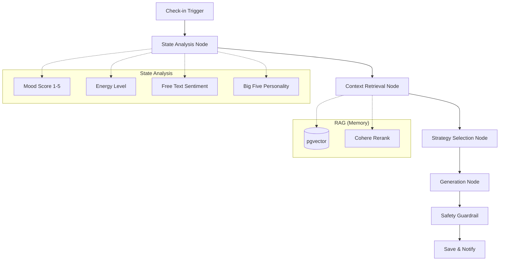

# AI コーチングメッセージ生成システム設計書 (v3.0)

## 1. 概要
本ドキュメントは、ユーザーの日次チェックイン（気分・エネルギー・メモ）と性格特性（Big Five）に基づき、気分とエネルギーを向上させるためのパーソナライズされたコーチングメッセージを生成するシステムの詳細設計である。

`trait-flow-screen` のロジック（状態に基づくテンプレート選択）を `trait-flow-mvp3.0` の Orchestrator アーキテクチャ（LangGraph, RAG, LLM）に統合し、より適応性の高い介入を実現する。

## 2. アーキテクチャ概要
メッセージ生成は Python 製 **Orchestrator** 上の **LangGraph** ワークフローとして実装される。

### 2.1 フロー図


## 3. 処理詳細 (LangGraph Nodes)

### Node 1: State Analysis (状態分析)

ユーザーの入力と属性を正規化し、分析コンテキストを作成する。
- 入力: `user_id`, `checkin_payload` (mood, energy, note)
- 処理:
  - **TIPI特性取得**: `baseline_traits` テーブルからユーザーの性格特性を取得。
  - **感情分析 (簡易)**: メモ (note) がある場合、テキストの感情極性を判定（ポジティブ/ネガティブ/ニュートラル）。
  - **トレンド計算**: 直近7日間の `checkins` を取得し、気分トレンド（上昇/下降/安定）を算出。

### Node 2: Context Retrieval (RAG & Rerank)

過去の類似状況において、どの介入が有効だったかを検索する。
- 処理:
  1. **Query生成**: 「気分:{mood}, エネルギー:{energy}, 内容:{note}」をベクトル化。
  2. **KNN検索**: `memories` (過去の介入・日記) から top-k=100 を検索。
  3. **Reranking**: Cohere Rerank v2 を使用し、現在の状況に最も関連性が高い、かつ過去に高評価 (feedback_score >= 4) を得たエピソードを top-k=5 に絞り込む。
- 目的: 「過去にこのユーザーは落ち込んでいる時、励ましよりも具体的な行動提案で回復した」といった暗黙知をコンテキストに含める。

### Node 3: Strategy Selection (介入戦略決定)

`trait-flow-screen` のロジックを踏襲し、基本となる介入スタンス（Template Type）を動的に決定する。

| 条件 (優先度順) | 戦略タイプ | 目的 | システム指示 (System Prompt方針) |
| --- | --- | --- | --- |
| 気分スコア ≤ 2.5 | Compassion (受容・共感) | 感情の妥当性を認め、安心感を与える | "批判せず、感情に寄り添う。無理な行動を促さず、セルフケアを提案する。" |
| 気分スコア 2.6 - 3.5 かつ 下降トレンド | Reflection (内省・気づき) | パターン認識を促し、視点を転換する | "好奇心を持って穏やかに問いかける。原因や感情の背景を探る手助けをする。" |
| 気分スコア > 3.5 または 上昇トレンド | Action (行動・成長) | モメンタムを維持し、具体的な前進を促す | "エネルギッシュで前向きなトーン。具体的で小さな行動目標や、強みの活用を提案する。" |

※ LangGraph の条件付きエッジを使用して分岐を管理する。

### Node 4: Generation (LLM生成)

決定された戦略とコンテキストに基づき、メッセージを生成する。
- **Model**: OpenAI gpt-4o (または chatgpt-4o-latest)
- **Structured Output**: 以下のJSONスキーマを強制する。
  ```json
  {
    "title": "短いタイトル (20文字以内)",
    "body": "メッセージ本文 (200文字以内)",
    "suggested_action": "具体的なアクション (任意)",
    "tone_used": "compassion | reflection | action"
  }
  ```
- **Prompt構成要素**:
  - **User Persona**: Big Five スコア（例: 「神経症傾向が高いユーザーなので、不安を煽らない表現を選ぶ」）。
  - **Current State**: 気分、エネルギー、メモの内容。
  - **Strategy**: Node 3 で決定した戦略。
  - **RAG Context**: 過去の有効だった介入例。

## 4. データフローと保存

### 4.1 入力 (UI -> API)

```
POST /api/checkins
```

```json
{
  "mood_score": 2,
  "energy_level": "low",
  "note": "仕事でミスをしてしまって落ち込んでいる"
}
```

### 4.2 出力 (API -> UI)

Orchestrator は生成結果を `interventions` テーブルに保存し、UI に返す。

```json
{
  "id": "uuid",
  "title": "自分を責めないで",
  "body": "ミスをしてしまうと辛いですよね。でも、それはあなたが責任感を持って取り組んでいる証拠でもあります。今は少し休んで、温かい飲み物でもいかがですか？",
  "tone": "compassion"
}
```

### 4.3 フィードバックループ

ユーザーがメッセージに対して「役に立った (Rating: 5)」と評価した場合、その介入レコードは `memories` テーブルにベクトル化して保存され、次回の Context Retrieval で「成功事例」として参照される。これにより、使えば使うほどユーザーの好みに適応する。

## 5. 実装フェーズ

1. **Phase 1 (ロジック移行)**:
   - `trait-flow-screen` の `intervention-processor.ts` 内のロジックを Python (LangGraph) に移植。
   - RAG なしの状態で、ルールベース分岐 + LLM 生成を実装。
2. **Phase 2 (RAG統合)**:
   - pgvector と Cohere Rerank を接続。
   - 過去のチェックインとメモをコンテキストに含める。
3. **Phase 3 (パーソナライズ強化)**:
   - Big Five 特性に応じた言い回しの微調整（例: 開放性が高い人にはメタファーを多用するなど）をプロンプトに組み込む。
